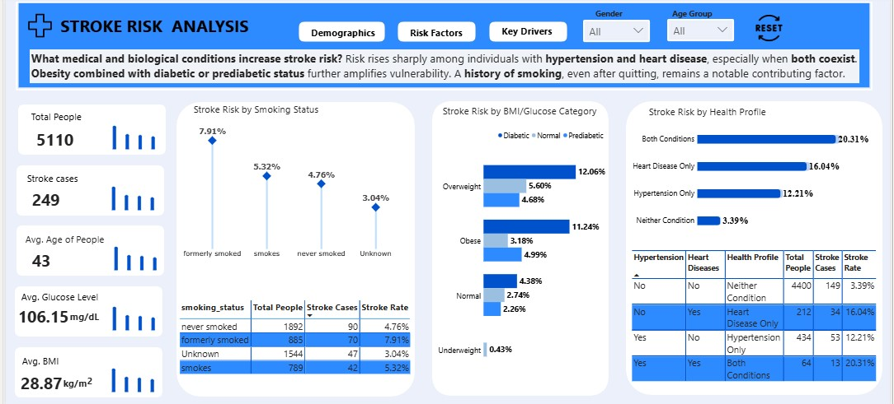
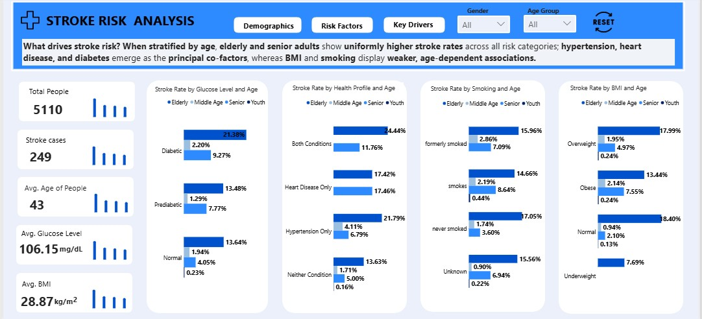

# Stroke-Risk-Analysis
A stroke risk analysis examining how age, medical conditions, and lifestyle factors influence stroke prevalence.
# Stroke Risk Analysis Report

## 1. Overview
Stroke is a critical public health challenge, contributing to mortality and long-term disability. Understanding factors that drive stroke risk is essential to guide targeted interventions and preventive healthcare strategies. This report provides an in-depth analysis of 5,110 patient records to identify key drivers of stroke, stratified by age, lifestyle, and clinical factors, using SQL-based queries and Power BI visualizations.

## 2. Rationale for the Project
Despite global healthcare advancements, stroke remains a leading cause of morbidity. The rationale for this project is to:

- Quantify stroke risk across demographic, clinical, and lifestyle factors.
- Identify high-risk subgroups and combinations of risk factors.
- Provide actionable insights to support clinical decision-making and preventive health policies.

## 3. Objectives
- Determine the prevalence of stroke across different age groups, genders, and work types.
- Identify key clinical and lifestyle factors associated with increased stroke risk.
- Stratify stroke risk by age to distinguish age-independent co-factors.
- Provide data-driven recommendations to reduce stroke incidence among high-risk populations.

## 4. Data Description
- **Dataset size:** 5,110 patient records
- **Attributes:** `id`, `gender`, `age`, `hypertension`, `heart_disease`, `ever_married`, `work_type`, `residence_type`, `avg_glucose_level`, `bmi`, `smoking_status`, `stroke`
- **Data cleaning:**
  - 201 missing BMI values imputed using median per age group:
    - Youth (0–35), Middle age (36–50), Senior (51–65), Elderly (66+)
  - Categorical transformations:
    - Hypertension, heart disease, and stroke converted from numeric to Yes/No
    - Glucose categorized: Normal, Pre-diabetic, Diabetic
    - BMI categorized: Underweight, Normal, Overweight, Obese

## 5. Tech Stack
- Data Extraction & Querying: SQL (PostgreSQL/SQLite)
- Data Cleaning & Transformation: SQL
- Visualization & Reporting: Power BI (including lollipop charts, conditional formatting, and stratified visuals)

## 6. Project Scope
- Focused on age-stratified stroke risk analysis, identifying clinical and lifestyle co-factors.
- Observational dataset; causality cannot be inferred.
- Target audience: healthcare providers, hospital administrators, and public health policymakers.
- Excludes predictive modeling beyond descriptive analytics and stratification.

## 7. Methodology
1. **Data Cleaning & Imputation**
   - Missing BMI values (201) filled using median per age group.
   - All categorical variables standardized for analysis.

2. **Age Stratification**
   - Groups: Youth (0–35), Middle age (36–50), Senior (51–65), Elderly (66+)
   - Stratified analyses performed to determine age-independent vs age-dependent risk factors

3. **Exploratory Data Analysis (EDA)**
   - SQL queries computed total individuals, stroke cases, and stroke rates
   - Risk factor prevalence analyzed across age groups, gender, work type, marital status, BMI, glucose levels, smoking, and medical conditions

4. **Visualization**
   - Power BI used to create interactive visuals for decision-making:
     - Stroke rate by age, BMI, glucose, smoking, and combined health conditions
     - Conditional formatting to highlight high-risk groups
     - Lollipop charts and bar charts to emphasize differences between age groups

## 8. Project Visualization
- **Stroke by Age:** Elderly had the highest stroke prevalence (156 cases), followed by senior (70), middle age (20), youth (3)
- **Stroke by Gender & Age:**
  - Elderly: 91 female, 165 male
  - Senior: 33 female, 37 male
  - Middle age: 14 female, 6 male
  - Youth: 3 female
- **Stroke by Marital Status:** Married individuals had higher stroke incidence across all age groups
- **Stroke by Work Type:** Private and self-employed individuals exhibited the highest stroke rates, particularly among elderly
- **Stroke by Medical Conditions:**
  - Hypertension + heart disease: 20.31%
  - Heart disease only: 16.04%
  - Hypertension only: 12.21%
  - Neither: 3.39%
- **Stroke by Smoking Status:** Former smokers (7.91%) > Current smokers (5.32%) > Never smoked (4.76%) > Unknown (3.04%)
- **Stroke by BMI & Glucose Categories:**
  - Diabetic + Overweight: 12.06%
  - Diabetic + Obese: 11.24%
  - Normal glucose + Underweight: 0.43%

    ---
    
    
    

    
    

## 9. Results (Key Findings)

### 9.1 Age as a Primary Risk Driver
- Across all categories, elderly consistently have the highest stroke rates
- Even when a risk factor is absent (e.g., never smoked or normal glucose), elderly still show elevated stroke rates
- Age acts as a strong baseline risk factor and effect modifier for other co-factors

### 9.2 Dominant Co-factors
- Hypertension, heart disease, and diabetes are the principal co-factors associated with higher stroke rates, particularly in older adults
- BMI and smoking present weaker, largely age-dependent associations

### 9.3 Demographic and Lifestyle Observations
- Stroke incidence is higher among married individuals and males in elderly age group
- Work type influences stroke risk: private and self-employed adults are most affected

## 10. Recommendations (Prioritized)
1. **Clinical Interventions**
   - Prioritize elderly and senior adults with hypertension, heart disease, or diabetes for routine screening and preventive care
2. **Lifestyle & Preventive Programs**
   - Target former and current smokers with cessation programs and monitoring
   - Promote BMI and glucose management through public health campaigns
3. **Workplace Health Programs**
   - Implement preventive initiatives in private and self-employed sectors
4. **Age-Stratified Public Health Policy**
   - Establish risk profiling and early intervention programs for high-risk age groups
5. **Monitoring and Evaluation**
   - Develop dashboards in Power BI for continuous tracking of high-risk populations and interventions

## 11. Future Work
- Expand dataset with additional clinical indicators (cholesterol, blood pressure history)
- Develop predictive models using SQL-based aggregation and scoring methods
- Conduct longitudinal studies to monitor trends and evaluate interventions
- Explore regional differences in stroke prevalence for more targeted policy interventions

## 12. Conclusion
The analysis demonstrates that age is the strongest driver of stroke, with elderly and senior adults consistently showing the highest risk. Hypertension, heart disease, and diabetes are the primary co-factors, while BMI and smoking contribute in an age-dependent manner. These insights provide a data-driven foundation for targeted interventions, policy development, and preventive healthcare planning.

---
Written by **Oyinlola Kayode, Data Analyst**. [Let's connect on LinkedIn](https://www.linkedin.com/in/kayode-0yinlola/).

